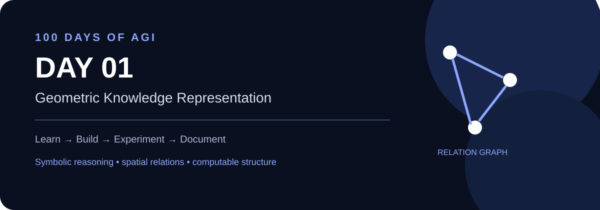

# 🧠 AGI — 100 Days of Artificial General Intelligence

<div align="center">



### **Learn → Build → Experiment → Document**

A living research/build log exploring **reasoning, agents, symbolic AI, spatial intelligence, multimodal systems, and emerging AI technology**.

[](./days/DAY_01.md)
[](./days/DAY_01.md)
[](#)

</div>

---

## ⚡ What is this?

This is **not a course dump**.

This repository is a 100-day public build log where every day produces something tangible:

- 🧠 one important concept
- 💻 one implementation or experiment
- 🔬 one observation/result
- 📝 one concise research note
- 🆕 one check for relevant new technology
- ➡️ one clear next step

The long-term direction is a research-oriented exploration of **symbolic reasoning + geometric knowledge + multimodal intelligence + autonomous systems**.

---

## 🗺️ 100-Day Roadmap

<details open>
<summary><b>Phase 01 — Foundations · Days 01–20</b></summary>

| Day | Topic | Status |
|---|---|---|
| **01** | Geometric Knowledge Representation | 🟢 Current |
| 02 | Symbolic Rules & Inference | ⬜ |
| 03 | Knowledge Graphs | ⬜ |
| 04 | Ontologies & Concepts | ⬜ |
| 05 | Constraint Reasoning | ⬜ |
| 06–10 | Reasoning experiments | ⬜ |
| 11–20 | Multimodal + spatial foundations | ⬜ |

</details>

<details>
<summary><b>Phase 02 — Spatial Intelligence · Days 21–40</b></summary>

3D representations • point clouds • meshes • graph geometry • spatial reasoning • geometric learning

</details>

<details>
<summary><b>Phase 03 — Agents & Reasoning · Days 41–60</b></summary>

Tool use • planning • memory • verification • agent loops • neuro-symbolic systems

</details>

<details>
<summary><b>Phase 04 — Generative Intelligence · Days 61–80</b></summary>

Generative models • optimization • evolutionary search • simulation • computational morphogenesis

</details>

<details>
<summary><b>Phase 05 — Integrated AGI Experiments · Days 81–100</b></summary>

Multimodal perception → structured world model → reasoning → action → verification → explanation

</details>

---

## 🚀 Start Here

### [📖 Day 01 — Geometric Knowledge Representation](./days/DAY_01.md)

**Question:** Can a machine represent a simple spatial world as explicit knowledge and reason over it?

**Build:** a tiny geometric knowledge graph.

**Result:** derive distance and directional relationships from structured coordinates.

---

## 🧩 The Core Loop

```text
        ┌───────────────────┐
        │   Learn a concept │
        └─────────┬─────────┘
                  ↓
        ┌───────────────────┐
        │   Build something │
        └─────────┬─────────┘
                  ↓
        ┌───────────────────┐
        │ Run an experiment │
        └─────────┬─────────┘
                  ↓
        ┌───────────────────┐
        │ Document the result│
        └─────────┬─────────┘
                  ↓
        ┌───────────────────┐
        │ Check new tech 🆕 │
        └─────────┬─────────┘
                  ↓
               NEXT DAY
```

---

## 🆕 New Technology Radar

AI moves too quickly for a fixed 100-day syllabus.

So the roadmap is **intentionally allowed to change**.

When a relevant technology appears, we'll:

**Discover → Test → Compare → Integrate / Skip**

Possible areas:

- New reasoning models
- Multimodal models
- Agent frameworks
- Open-source models
- Spatial / 3D AI
- Neuro-symbolic methods
- World models
- Robotics / embodied AI
- New developer tooling

A technology only enters the core project when the experiment shows a useful reason.

---

## 🧭 Long-Term Architecture

```text
                 Human / Environment
                         │
                         ▼
              ┌─────────────────────┐
              │ Multimodal Perception│
              └──────────┬──────────┘
                         ▼
              ┌─────────────────────┐
              │ World Representation │
              │ text / graph / 3D   │
              └──────────┬──────────┘
                         ▼
              ┌─────────────────────┐
              │ Reasoning + Memory  │
              └──────────┬──────────┘
                         ▼
              ┌─────────────────────┐
              │ Planning + Tools    │
              └──────────┬──────────┘
                         ▼
              ┌─────────────────────┐
              │ Verify + Explain    │
              └──────────┬──────────┘
                         ▼
                    Action / Output
```

---

## 📚 Daily Index

| Day | Focus | Link |
|---:|---|---|
| 01 | Geometric Knowledge Representation | [Open →](./days/DAY_01.md) |
| 02 | Symbolic Rules & Inference | Coming next |
| 03 | Knowledge Graphs | Coming soon |
| 04 | Ontologies | Coming soon |
| 05 | Constraint Reasoning | Coming soon |

> This index will grow every day. No fake progress bars — only committed work.

---

## 🔭 Research Direction

The existing research direction of this repository explores the intersection of:

**AI/ML + symbolic reasoning + spatial/geometric computing + engineering/design automation.**

The 100-day build turns that high-level direction into small, reproducible experiments.

---

<div align="center">

### **Day 01 / 100**

**The goal isn't to claim AGI.  
The goal is to understand, build, test, and document the pieces.**

</div>
