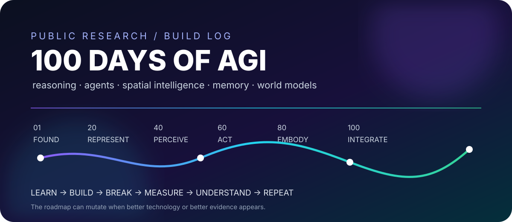

# 🧠 100 DAYS OF AGI

### BUILDING INTELLIGENCE — ONE EXPERIMENT AT A TIME

**Learn · Build · Break · Measure · Understand · Repeat**

---

## ⚡ WHAT IS THIS?

You gave me one word:

> **AGI**

Everything else is allowed to evolve.

This repository is a **100-day public research/build journey**. We are not following a five-topic syllabus. We are building a broad map across **reasoning, learning, language, vision, spatial intelligence, memory, agents, world models, robotics, neuro-symbolic AI, evaluation, and whatever genuinely important new technology appears along the way.**

The rule:

~~~text
QUESTION → RESEARCH → BUILD → BREAK / TEST → MEASURE → KEEP / CHANGE / DROP → NEXT DAY
~~~

---

## 🗺️ ENTER THE LAB

| 🚪 | Destination |
|---|---|
| 🟣 **Today's experiment** | [DAY 01 → Geometric Knowledge Representation](./days/DAY_01.md) |
| 🧭 **100-day map** | [ROADMAP →](./ROADMAP.md) |
| 🌐 **Resource atlas** | [RESOURCES →](./RESOURCES.md) |
| 🧪 **Day 01 code** | [geometric_knowledge.py →](./days/day-01/geometric_knowledge.py) |

<b>🎛️ OPEN THE LAB DASHBOARD</b>

### Current State

**DAY 01 / 100**

`[█░░░░░░░░░░░░░░░░░░] 1%`

**Current question**

> Can a machine represent a small world explicitly and reason over it without guessing?

**Current build**

`coordinates → relations → derived facts`

**Next unlock**

`symbolic rules → inference → multi-step reasoning`

---

## 🎬 DAY 01 — START HERE

### Geometric Knowledge Representation

We begin with something deliberately small.

A world contains objects. Objects have properties. Objects have relationships. Some relationships can be **computed**, not merely described.

~~~text
A = (0, 0)             B = (3, 4)

        B ●
          │
          │
          │
          │
A ●───────┘

distance(A,B) = 5
A is left of B
A is below B
~~~

The interesting transition is:

**description → representation → computation → reasoning**

👉 **[Read Day 01 →](./days/DAY_01.md)**

---

## 🧩 100 DAYS — THE MAP

The roadmap is deliberately broad. It is a **research map**, not a promise that every day will remain unchanged.

<b>01–10 · Foundations of Reasoning</b>

Geometric knowledge · symbolic rules · knowledge graphs · ontologies · constraints · unification · search · probabilistic reasoning · causal reasoning · hybrid reasoner

<b>11–20 · Learning Representations</b>

Embeddings · metric learning · GNNs · graph transformers · neural retrieval · vector databases · structured retrieval · memory representations · representation evaluation · neural-symbolic bridges

<b>21–30 · Multimodal Intelligence</b>

Vision encoders · VLMs · image-to-structure · scene graphs · spatial relations · 3D representations · point clouds · meshes · multi-view reasoning · multimodal world representation

<b>31–40 · Spatial Intelligence</b>

Coordinate systems · transformations · localization · mapping · spatial memory · geometric planning · topology · affordances · spatial benchmarks · spatial agents

<b>41–50 · Language, Retrieval & Memory</b>

Tokenization · attention · context · RAG · long-term memory · episodic memory · semantic memory · tool-augmented retrieval · memory evaluation · persistent memory prototype

<b>51–60 · Agents</b>

Tool use · function calling · planning loops · ReAct · multi-agent systems · agent memory · reflection · verification · computer use · autonomous research agent

<b>61–70 · Generative AI & World Models</b>

Generative models · diffusion · world representations · simulation · learned dynamics · world models · predictive representations · planning in learned worlds · evolutionary search · computational morphogenesis

<b>71–80 · Embodied / Physical Intelligence</b>

Robotics · perception-to-action · navigation · manipulation · robot memory · spatial tool use · simulation-to-real · physical constraints · embodied benchmarks · embodied intelligence loop

<b>81–90 · Neuro-Symbolic AGI</b>

Neural-symbolic architectures · differentiable logic · logic + embeddings · knowledge graph completion · rule learning · neuro-symbolic planning · program synthesis · verification · explanation · hybrid reasoning engine

<b>91–100 · Integrated AGI Experiments</b>

Unified world model · perception → memory · memory → reasoning · reasoning → planning · planning → action · action → observation · self-evaluation · continual learning · full-system experiment · research demo

**Full version → [ROADMAP.md](./ROADMAP.md)**

---

## 🧪 THE DAILY FORMAT

Every day should leave something **real** behind.

📖 <b>1 — Research</b>

Read papers, docs, implementations, benchmarks, technical reports and primary sources.

🔨 <b>2 — Build</b>

Write the smallest useful implementation. Prefer something runnable over another page of theory.

💥 <b>3 — Break</b>

Try edge cases. Compare approaches. Find where the idea fails.

📊 <b>4 — Measure</b>

Record outputs, accuracy, latency, cost, failure cases or whatever metric actually matters.

📝 <b>5 — Explain</b>

Document what happened, what changed in our mental model, and what should happen next.

---

## 🆕 THE NEW-TECH RADAR

**This is the part that makes the 100 days alive.**

The roadmap is not frozen.

If a new model architecture, agent protocol, spatial model, world model, reasoning technique, benchmark, open-source framework, robotics stack or other technology becomes relevant, we can interrupt the roadmap and test it.

~~~text
NEW TECH
   ↓
DISCOVER → READ → REPRODUCE → BENCHMARK
                                  ↓
                         INTEGRATE / REJECT
~~~

Recent spatial-intelligence research has expanded toward brain-inspired spatial intelligence, spatial-functional benchmarks, multi-view reasoning, and spatial agents/world models. These are exactly the kinds of developments that can change what we build next. 

**Resource radar → [RESOURCES.md](./RESOURCES.md)**

---

## 🌍 THE BIG PICTURE

~~~mermaid
flowchart LR
    A[Environment] --> B[Perception]
    B --> C[World Representation]
    C --> D[Memory]
    D --> E[Reasoning]
    E --> F[Planning]
    F --> G[Tools / Action]
    G --> H[Observation]
    H --> D
    E --> I[Verification]
    I --> J[Explanation]
~~~

The long-term experiment is not:

> “Build a chatbot.”

It is:

> **Can multiple forms of intelligence be connected into a system that can perceive, represent, remember, reason, act, verify and explain?**

---

## 🌐 RESOURCE UNIVERSE

We will pull knowledge from **every useful layer**:

**Papers · research labs · open-source repos · benchmarks · datasets · documentation · books · courses · technical reports · simulators · developer tools**

Starting points:

- [Avik Jain — 100 Days of ML Code](https://github.com/Avik-Jain/100-Days-Of-ML-Code)
- [LLMs from Scratch](https://github.com/rasbt/LLMs-from-scratch)
- [nanoGPT](https://github.com/karpathy/nanoGPT)
- [Hugging Face](https://huggingface.co/)
- [Papers with Code](https://paperswithcode.com/)
- [arXiv AI](https://arxiv.org/list/cs.AI/recent)

**→ [Open the full Resource Atlas](./RESOURCES.md)**

---

## 🧭 RULES OF THE 100 DAYS

| Rule | Meaning |
|---|---|
| **Build > collect** | A repo full of links is not an experiment. |
| **Evidence > hype** | New does not automatically mean useful. |
| **Failure counts** | A broken experiment is still data. |
| **Small → hard** | Start with inspectable systems, then increase complexity. |
| **Measure** | Serious claims need an experiment or source. |
| **Stay flexible** | New technology can change the roadmap. |
| **Keep history** | Git commits are the research diary. |

---

### 🟣 DAY 01 / 100

**WE ARE NOT CLAIMING AGI.**

**WE ARE BUILDING TOWARD UNDERSTANDING IT.**

[🚀 ENTER DAY 01](./days/DAY_01.md) · [🗺️ ROADMAP](./ROADMAP.md) · [🌐 RESOURCES](./RESOURCES.md)

